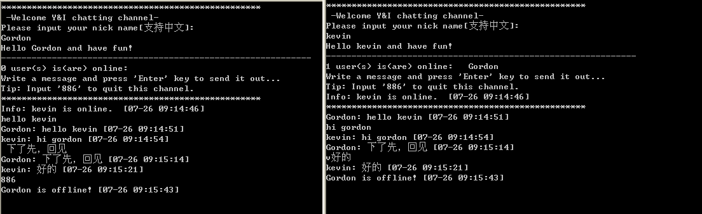

## what is uandi chat?
A chat tool implemented by java (支持中文)


## how to use
run server.class by java then other pcs can use telnet command to connect server
```
    telnet server_ip_address 9999
```


